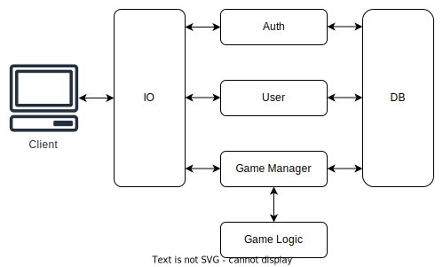

<div style="text-align:center; margin: 100px;">

    
</div>

# TicTactics
This application is a web-based implementation of the game Tic-Tactics. The game was originaly created by studio [HiddenVariable](https://www.hiddenvariable.com/), but near 2017 it has been [taken down](https://www.hiddenvariable.com/tictactics/). 

This project is an attempt to recreate the game.

## 🏛️ Architecture

A high level architecture diagram of the service is shown below.

<div style="text-align: center;">
    
</div>

Below is a description of the components of the service.

### 🚀 API
It will be deployed as a REST API with the following endpoint groups:

| Endpoint | Description               |
|----------|---------------------------|
| `/auth`  | Authentication endpoints  |
| `/user`  | User management endpoints |
| `/game`  | Game management endpoints |

#### Authentication Endpoints

| Endpoint         | Method | Description        |
|------------------|------  |--------------------|
| `/auth/session`  | GET    | Validate a session |
|                  | POST   | Create a session   |
|                  | DELETE | Remove session     |

#### User Management Endpoints

| Endpoint | Method | Description      |
|----------|------  |------------------|
| `/user`  | GET    | Get a user       |
|          | POST   | Create a session |

#### Game Management Endpoints

| Endpoint           | Method | Description      |
|--------------------|--------|------------------|
| `/game/create`     | POST   | Create a game    |
| `/game/join`       | PUT    | Join a game      |
| `/game/leave`      | PUT    | Leave a game     |
| `/game/list-games` | GET    | List games       |
| `/game`            | GET    | Get a game       |
|                    | PUT    | Update a game    |

### 💾 Database
#### 📜 Schema
The database will follow this relationship schema:

<div style="text-align: center;">
    
</div>

Since one of the implementation options is DynamoDB, before designing the database, it is important to understand the [data model](https://docs.aws.amazon.com/amazondynamodb/latest/developerguide/HowItWorks.CoreComponents.html#HowItWorks.CoreComponents.DataModel) of DynamoDB and how to [model relationships](https://docs.aws.amazon.com/amazondynamodb/latest/developerguide/bp-modeling-nosql-B.html) between entities. First we have to describe the access patterns that will occur.

#### Access Patterns
1. User Access Patterns
    1. Get a user by username
    1. Get a user by email
    1. Get a user by uid

1. Password Access Patterns
    1. Get a password by uid

1. Game Access Patterns
    1. Get a game by player id

1. Session Access Patterns
    1. Get a session by uid

#### 💾 DynamoDB Data Model
#### Design
Based on the access patterns described in the code, we can design a DynamoDB table with the following attributes:

* PK: Partition key
* SK: Sort key
* GSI1PK: Global secondary index partition key
* GSI1SK: Global secondary index sort key

Here is a possible design for the DynamoDB table:

#### Table: TicTactics
| Attribute | Type   | Description                                                                 |
|-----------|--------|-----------------------------------------------------------------------------|
| PK        | String | Partition key. Possible values: USER#{username}, EMAIL#{email}, UID#{uid}, PASSWORD#{uid}, GAME#{gameId}, SESSION#{sessionId} |
| SK        | String | Sort key. Possible values: USER, PASSWORD, GAME, SESSION                     |
| GSI1PK    | String | Global secondary index partition key. Possible values: GAME#{playerId}      |
| GSI1SK    | String | Global secondary index sort key. Possible values: GAME                       |

#### Accessing the table
User Access Patterns
1. Get a user by username

    Query the table with ```PK = USER#{username} ```and``` SK = USER.```

1. Get a user by email

    Query the table with ```PK = EMAIL#{email} ```and``` SK = USER.```

1. Get a user by uid

    Query the table with ```PK = UID#{uid} ```and``` SK = USER.```

Password Access Patterns
1. Get a password by uid

    Query the table with ```PK = PASSWORD#{uid} ```and``` SK = PASSWORD.```

Game Access Patterns
1. Get a game by player id

    Query the table with ```GSI1PK = GAME#{playerId} ```and``` GSI1SK = GAME.```

Session Access Patterns
1. Get a session by uid

    Query the table with ```PK = SESSION#{sessionId} ```and``` SK = SESSION.```